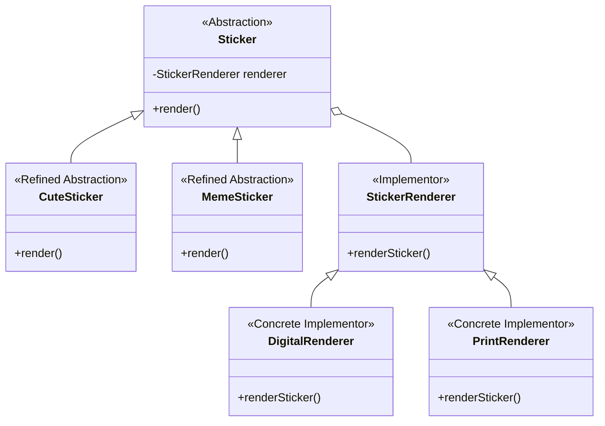

# Assignment 3 — Bridge Design Pattern

## Sticker Pack Designer

**Student:** Aruzhan Imanmadiyeva  
**Group:** SE-2514  
**Course:** Software Design Patterns  
**Design Pattern:** Bridge Pattern

---

## 1. Project Description

This project demonstrates the **Bridge Design Pattern** using a Sticker Pack Designer.

The main idea is to separate sticker types from the way stickers are rendered. This allows different sticker types and rendering methods to work together without changing the abstraction classes.

The project is implemented in Java.

---

## 2. Bridge Pattern Structure

The project has two independent sides:

### Abstraction Side

- `Sticker` — Abstraction
- `CuteSticker` — Refined Abstraction
- `MemeSticker` — Refined Abstraction

### Implementation Side

- `StickerRenderer` — Implementor
- `DigitalRenderer` — Concrete Implementor
- `PrintRenderer` — Concrete Implementor

### Structure




## 3. Classes and Their Roles
**Sticker**

Sticker is the main Abstraction.

It contains a reference to StickerRenderer and defines the abstract create() operation.

**CuteSticker**

CuteSticker is a Refined Abstraction.

It represents a cute sticker and uses the renderer provided by the abstraction.

**MemeSticker**

MemeSticker is a Refined Abstraction.

It represents a meme sticker and uses the renderer provided by the abstraction.

**StickerRenderer**

StickerRenderer is the Implementor interface.

It defines the render() operation that concrete renderers must implement.

**DigitalRenderer**

DigitalRenderer is a Concrete Implementor.

It represents digital rendering of a sticker in PNG format for a phone.

**PrintRenderer**

PrintRenderer is a Concrete Implementor.

It represents rendering a sticker for high-quality printing.

**Main**

Main is the Client.

It creates sticker objects with different renderers and demonstrates switching the implementation at runtime.

## 4. Runtime Switching

The project demonstrates that the implementation can be changed without changing the abstraction.

For example:

Sticker cuteSticker =
        new CuteSticker(new DigitalRenderer());

cuteSticker.create();

cuteSticker.setRenderer(new PrintRenderer());

cuteSticker.create();

The same CuteSticker first uses DigitalRenderer and then uses PrintRenderer.

The CuteSticker class does not need to be changed.

This demonstrates that the abstraction and implementation are separated.

## 5. Clean Code Principles
**1. Single Responsibility Principle**

Each class has one main responsibility.

Sticker manages the abstraction.
CuteSticker and MemeSticker represent sticker types.
DigitalRenderer handles digital rendering.
PrintRenderer handles print rendering.

**2. Meaningful Names**

Class and method names clearly describe their purpose.

Examples:

CuteSticker
MemeSticker
DigitalRenderer
PrintRenderer

**3. Separation of Responsibilities**

Sticker types and rendering methods are separated.

The sticker classes do not contain detailed rendering logic.

**4. No Duplicated Logic**

Rendering logic is placed inside the concrete renderer classes instead of being duplicated in every sticker class.

**5. Open for Extension**

A new renderer can be added by implementing StickerRenderer.

For example, a future WebRenderer could be added without changing the existing sticker classes.

**6. Example Output**

Cute sticker: Digital sticker: Cute Cat
Text: Have a nice day!
Format: PNG for phone

Cute sticker: Printable sticker: Cute Cat
Text: Have a nice day!
Format: high-quality print

Meme sticker: Digital sticker: Funny Meme
Text: When the code finally works!
Format: PNG for phone

**7. How to Run**

Open the project in IntelliJ IDEA.

Open Main.java.

Run the main() method.

Check the output in the console.

**8. Advantages of the Bridge Pattern**

The Bridge Pattern provides several advantages in this project:

Abstraction and implementation can change independently.
New sticker types can be added without changing renderers.
New renderers can be added without changing sticker types.
The project avoids creating a separate class for every sticker-renderer combination.
The code is easier to extend and maintain.

**9. Design Pattern Roles**

| Bridge Role          | Project Class     |
| -------------------- | ----------------- |
| Abstraction          | `Sticker`         |
| Refined Abstraction  | `CuteSticker`     |
| Refined Abstraction  | `MemeSticker`     |
| Implementor          | `StickerRenderer` |
| Concrete Implementor | `DigitalRenderer` |
| Concrete Implementor | `PrintRenderer`   |
| Client               | `Main`            |

**10. Project Structure**
```text
StickerPackDesigner/
│
├── src/
│   ├── Sticker.java
│   ├── CuteSticker.java
│   ├── MemeSticker.java
│   ├── StickerRenderer.java
│   ├── DigitalRenderer.java
│   ├── PrintRenderer.java
│   └── Main.java
│
└── README.md
```
**11. Conclusion**

This project demonstrates the Bridge Design Pattern by separating sticker abstractions from rendering implementations.

A sticker can use different renderers without changing the sticker class. This allows both sides of the system to vary independently.

The project satisfies the main Bridge Pattern requirements:

Abstraction,
Refined Abstractions,
Implementor,
Concrete Implementors,
Client,
Runtime switching of implementations,
Clean Code principles.
